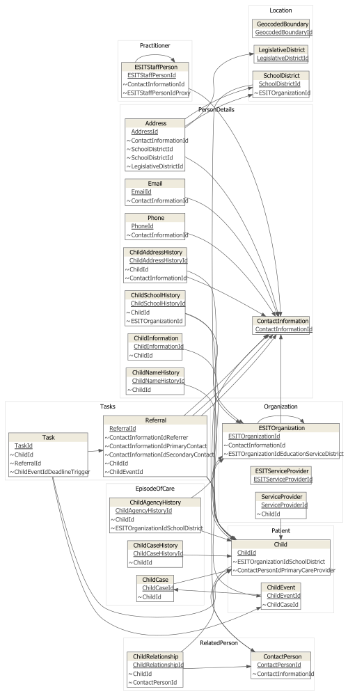
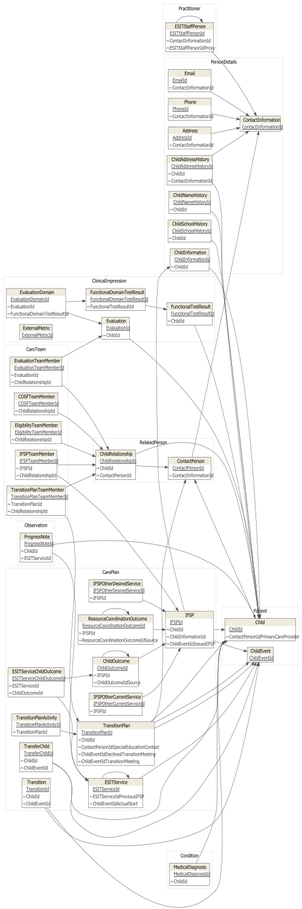
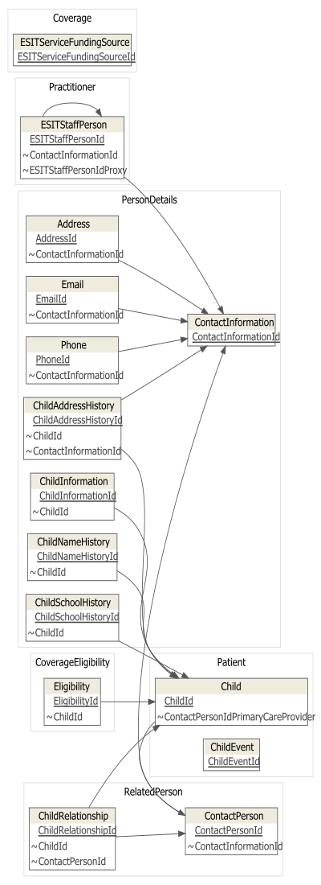
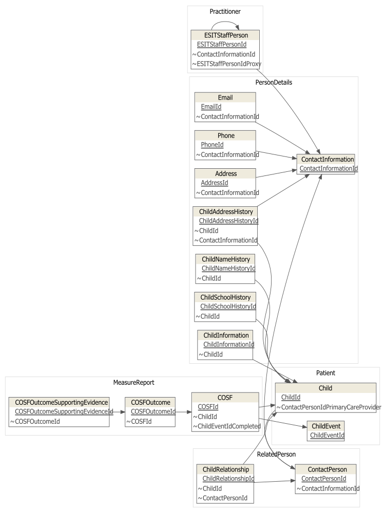

# Legacy Database Analysis

## Background

The ESIT-DMS database is replicated on a weekly basis (each Monday). It is accessible from the DCYF domain either by Windows Authentication or by SQL Server Authentication (see Bon for login information).

```{r setup, include=FALSE}
library(tidyverse)
#devtools::install_github("bergant/datamodelr")
dotenv::load_dot_env()
```

The database runs on SQL Server 2016 and sits (along with other early learning replicas outside the scope of this migration) on a physical box behind the DCYF firewall (i.e. `delolydb12021`). Within R, a connection object (`con`) can be established with the the `odbc` package (@R-odbc) as follows:  

```{r db_connnection, include=FALSE}

con <- odbc::dbConnect(
  odbc::odbc(),
  driver = "SQL Server",
  server = 'delolydb12021',
  Database = 'ESITDMS',  
  UID = Sys.getenv('UID'),
  PWD = Sys.getenv('PWD')
)

```

The following query (assigned to a dataframe named `table_query`) serves as the starting point for analysis of the database. As can be seen, we exclude (for now), configuration tables, lookup tables, access logs, and other tables which do not appear as core concepts for ESIT.  
  
```{sql, connection = con, output.var="table_query"}
SELECT 
    *
FROM
    information_schema.tables
WHERE
	TABLE_TYPE = 'BASE TABLE'
		AND TABLE_NAME NOT LIKE '%Type%'
		AND TABLE_NAME NOT LIKE '%Log%'
		AND TABLE_NAME NOT LIKE '%Map%'
		AND TABLE_NAME NOT LIKE '%System%'
		AND TABLE_NAME NOT LIKE '%Configuration%'
		AND TABLE_NAME NOT LIKE '%Template%'
		AND TABLE_NAME NOT LIKE '%Action%'
		AND TABLE_NAME NOT LIKE '%Version%'
		AND TABLE_NAME NOT LIKE '%Request%'
		AND TABLE_NAME NOT LIKE '%Manager%'
		AND TABLE_NAME NOT LIKE '%Document%'
		AND TABLE_NAME NOT LIKE '%Reminder%'
		AND TABLE_NAME NOT LIKE '%Alert%'
		AND TABLE_NAME NOT LIKE '%Notification%'
		AND TABLE_NAME NOT LIKE '%User%'		
```

The result of the above query shows `r nrow(table_query)` tables to focus our initial analysis of the ESIT-DMS database as shown in the `datatable` output below [@R-DT]. The database has `r DBI::dbGetQuery(con, 'select * from information_schema.tables') %>% nrow()` tables in total. 

```{r}
DT::datatable(table_query)
```


## Table Segmentation

While the initial restrictions have certainly simplified the number of tables we need to deal with, it's still an unwieldy number to manage all at once. In order to more easily visualize these tables, and the relationships between the tables, we will segment the tables under the conceptual nomenclature of [HL7 FHIR](https://www.hl7.org/fhir/resourcelist.html) using the `datamodelr` package for reverse engineering mainstream databases [@R-datamodelr]. At this point, we do not have plans to adopt FHIR as a semantic or architectural standard for Acorn. It is just used here as an established nomenclature. The proposed segmentation into the FHIR nomenclature is as added to `table_query` as follows:

```{r}

table_query_seg <- table_query %>%
  mutate(
    focus_area = case_when(
    TABLE_NAME %in% c(
      "Child",
      "ChildEvent"
    ) ~ "patient_focus_tables",
    TABLE_NAME %in% c(
      "ChildInformation",
      "Address",
      "ChildNameHistory",
      "ChildSchoolHistory",
      "ContactInformation",
      "Phone",
      "ChildAddressHistory",
      "Email"
    ) ~ "person_focus_tables",
    TABLE_NAME %in% c(
      "ESITStaffPerson"
    ) ~ "practitioner_focus_tables", 
    TABLE_NAME %in% c(
      "InboxMessage",
      "InboxMessageRecipient"
    ) ~ "communication_focus_tables", 
    TABLE_NAME %in% c(
      "ContactPerson",
      "ChildRelationship"
    ) ~ "related_person_focus_tables",  
    TABLE_NAME %in% c(
      "ESITOrganization", 
      "ServiceProvider",
      "ESITServiceProvider"
    ) ~ "organization_focus_tables",   
    TABLE_NAME %in% c(
      "LegislativeDistrict",
      "SchoolDistrict",
      "GeocodedBoundary"
    ) ~ "location_focus_tables",
    TABLE_NAME %in% c(  
      "Referral",
      "Task"
    ) ~ "task_focus_tables",       
    TABLE_NAME %in% c(  
      "ChildCaseHistory",
      "ChildCase", 
      "ChildAgencyHistory"
    ) ~ "episode_of_care_focus_tables", 
    TABLE_NAME %in% c(  
      "MedicalDiagnosis"
    ) ~ "condition_focus_tables",
    TABLE_NAME %in% c(  
      "FunctionalDomainTestResult",
      "Evaluation",
      "EvaluationDomain",
      "FunctionalTestResult",
      "ExternalMetric"
    ) ~ "clinical_impression_tables",
    TABLE_NAME %in% c(  
      "ProgressNote"
    ) ~ "observation_focus_tables",
    TABLE_NAME %in% c(  
      "IFSP", 
      "TransferChild",
      "TransitionPlanActivity",
      "TransitionPlan",
      "IFSPOtherCurrentService",
      "IFSPOtherDesiredService",
      "ChildOutcome",
      "ESITServiceChildOutcome",
      "ResourceCoordinationOutcome",
      "ESITService",
      "Transition"
    ) ~ "care_plan_focus_tables",
    TABLE_NAME %in% c(  
      "IFSPTeamMember",
      "EligibilityTeamMember",
      "EvaluationTeamMember",
      "TransitionPlanTeamMember",
      "COSFTeamMember"
    ) ~ "care_team_focus_tables",
    TABLE_NAME %in% c(  
      "COSF",
      "COSFOutcome",
      "COSFOutcomeSupportingEvidence"
    ) ~ "measure_report_focus_tables",
    TABLE_NAME %in% c(  
      "ESITServiceFundingSource",
      "ESITService"
    ) ~ "coverage_focus_tables",
    TABLE_NAME %in% c(  
      "Eligibility"
    ) ~ "coverage_eligibilty_tables"    
  )
) 

 DT::datatable(table_query_seg)

```

```{r}

sQuery <- datamodelr::dm_re_query("sqlserver")

dat_esitdms_tables <- DBI::dbGetQuery(con, sQuery, stringsAsFactors = FALSE, errors=TRUE)

filter_focus <- function(focus_area_name) {
  table_query_seg %>% 
    filter(focus_area == focus_area_name) %>%
    .$TABLE_NAME %>%
    unique()
}

table_segments_base <- list(
  Patient = filter_focus("patient_focus_tables"),
  PersonDetails = filter_focus("person_focus_tables"),
  Practitioner = filter_focus("practitioner_focus_tables"),
  RelatedPerson = filter_focus("related_person_focus_tables"),
  Location = filter_focus("location_focus_tables"),
  Organization = filter_focus("organization_focus_tables"),
  Tasks = filter_focus("task_focus_tables"),
  EpisodeOfCare = filter_focus("episode_of_care_focus_tables")
)

table_segments_individuals_and_clinical <- list(
  Patient = filter_focus("patient_focus_tables"),
  PersonDetails = filter_focus("person_focus_tables"),
  Practitioner = filter_focus("practitioner_focus_tables"),
  RelatedPerson = filter_focus("related_person_focus_tables"),
  Condition = filter_focus("condition_focus_tables"),
  ClinicalImpression = filter_focus("clinical_impression_tables"),
  Observation = filter_focus("observation_focus_tables"),
  CarePlan = filter_focus("care_plan_focus_tables"),
  CareTeam = filter_focus("care_team_focus_tables")
)

table_segments_individuals_and_financial <- list(
  Patient = filter_focus("patient_focus_tables"),
  PersonDetails = filter_focus("person_focus_tables"),
  Practitioner = filter_focus("practitioner_focus_tables"),
  RelatedPerson = filter_focus("related_person_focus_tables"),
  Coverage = filter_focus("coverage_focus_tables"),
  CoverageEligibility = filter_focus("coverage_eligibilty_tables")
)

table_segments_individuals_and_specialized <- list(
  Patient = filter_focus("patient_focus_tables"),
  PersonDetails = filter_focus("person_focus_tables"),
  Practitioner = filter_focus("practitioner_focus_tables"),
  RelatedPerson = filter_focus("related_person_focus_tables"),
  MeasureReport = filter_focus("measure_report_focus_tables")
)

get_relationship_graph <- function(table_relations, segments, rankdir = "BT"){
  
  dat_esitdms_focus_tables <- table_relations %>%
    dplyr::mutate(ref = ifelse(ref %in% unname(unlist(segments)),
                               ref, NA)) %>%
    dplyr::filter(table %in% unname(unlist(segments)))
  
  
  dm_esitdms_focus_tables <- datamodelr::as.data_model(
    dat_esitdms_focus_tables
  )
  
  dm_esitdms_focus_tables_seg <- datamodelr::dm_set_segment(
    dm_esitdms_focus_tables, 
    segments
  )
  
  
  graph <- datamodelr::dm_create_graph(dm_esitdms_focus_tables_seg,
                                       rankdir = rankdir, # RL, BT, TB, LR
                                       view_type = "keys_only")
  
  return(graph)
  
}


datamodelr::dm_export_graph(
  get_relationship_graph(
    table_relations = dat_esitdms_tables,
    segments = table_segments_base, 
    "LR"
  ), 
  file_name = "base_tables.svg", 
  file_type = "svg", 
  width = 500,
  height = 1000)

```



```{r}
datamodelr::dm_export_graph(
  get_relationship_graph(
    table_relations = dat_esitdms_tables,
    segments = table_segments_individuals_and_clinical, 
    "LR"
  ), 
  file_name = "individuals_and_clinical.svg", 
  file_type = "svg", 
  width = 500,
  height = 1500)
```



```{r}
datamodelr::dm_export_graph(
  get_relationship_graph(
    table_relations = dat_esitdms_tables,
    segments = table_segments_individuals_and_financial, 
    "LR"
  ), 
  file_name = "individuals_and_financial.svg", 
  file_type = "svg", 
  width = 400,
  height = 1100)
```



```{r}
datamodelr::dm_export_graph(
  get_relationship_graph(
    table_relations = dat_esitdms_tables,
    segments = table_segments_individuals_and_specialized, 
    "LR"
  ), 
  file_name = "individuals_and_specialized.svg", 
  file_type = "svg", 
  width = 750,
  height = 1000)
```



